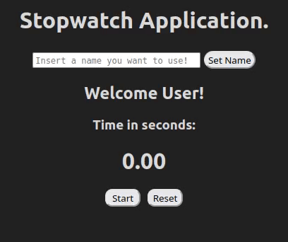
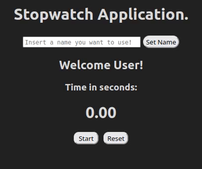

# 2022 React Web Application Assignment

Welcome to this web-app assignment repository!

Note that if you have not already, it is highly suggested you complete [this learning path](https://docs.microsoft.com/en-us/learn/paths/react/) before attempting this assignment.

## Requirements:

* [Visual Studio Code](https://code.visualstudio.com/) - Code editor.
* [Git](https://git-scm.com/) - Version Control system software.
* [GitHub Account](https://github.com/) - For hosting & storing your projects.
* [NodeJS v16](https://nodejs.org/en/download/) - We are using version 16 Node for this project.

## Contents:

* A skeleton project with the UI implemented.
* Unit tests that mimic web-app usage.
* This `README.md`.

## Assignment - Stopwatch Web Application

The aim of this assignment is to help challenge you with a real world goal of making a working stopwatch web application. Now that you have accomplished the workshop, you should be able to sharpen a bit of your acquired skillset in this assignment.

You may have noticed that there are `data-testid` properties in some HTML components. Do not change the values of these as the unit test uses these values to identify HTML elements for testing purposes.

### Recommended Steps to Setup before Starting:
The steps below assumes knowledge of the Github interface.

1.) Fork this repository.

2.) Clone your forked repository to your local machine.

3.) In your project directory, open a terminal and run the following command to install all the required node libraries:
```bash
npm install
```

4.) After the libraries are installed, run the following to start the application in the development environment:
```bash
npm start
```
Your browser should automatically open and your web application shown in a new tab. You may have noticed that the user interface is there, but the functionality of the application is not there.

### Exercise
Implement the functionality of the application. The user interface code is located in `/src/Pages/Main.tsx`. Your job is to ensure that in the implementation:

For setting name:
- [x] You can set a name between 1 to 32 characters.
- [x] The entry box prevents users from entering more than 32 characters.
- [x] Entry box should clear after the name has been set.
- [x] The `Set Name` button should change the greeter to greet user with the name set. See example below for required user greeting format.

Example Set Name Functionality (change from User to Jason):



For the stopwatch:
- [x] The timer string should update in real-time.
- [x] Pressing start button should start the timer and disable the reset button.
- [x] When the stopwatch is running, the start button should be changed to a pause button.
- [x] The reset button should be enabled when the stopwatch is not running.
- [x] The reset button should set the timer back to 0.

Example Stopwatch Functionality Showcase:



For the UI:
- [x] Start button should have the text `Start`
- [x] Pause button should have the text `Pause`
- [x] Reset button should have the text `Reset`
- [x] The timer value should have at least 2 decimal places.

### Hints:
* `Date.now()` - can return the timestamp of when the function is called.
* `setTimeout(() => {}, number_in_ms)` - run callback function after number_in_ms milliseconds have passed since the timeout function call.

### Unit tests:
A useful way to check that certain test cases are met when completing the application. You are not required to write them as the test cases are already written for the purpose of this assignment. It can be run via the command:
```bash
npm test
```
The unit testing library used for this project is [Jest](https://reactjs.org/docs/testing-recipes.html) which is bundled when creating a react-app template.

Note that it can take around a minute for the unit test to complete.
